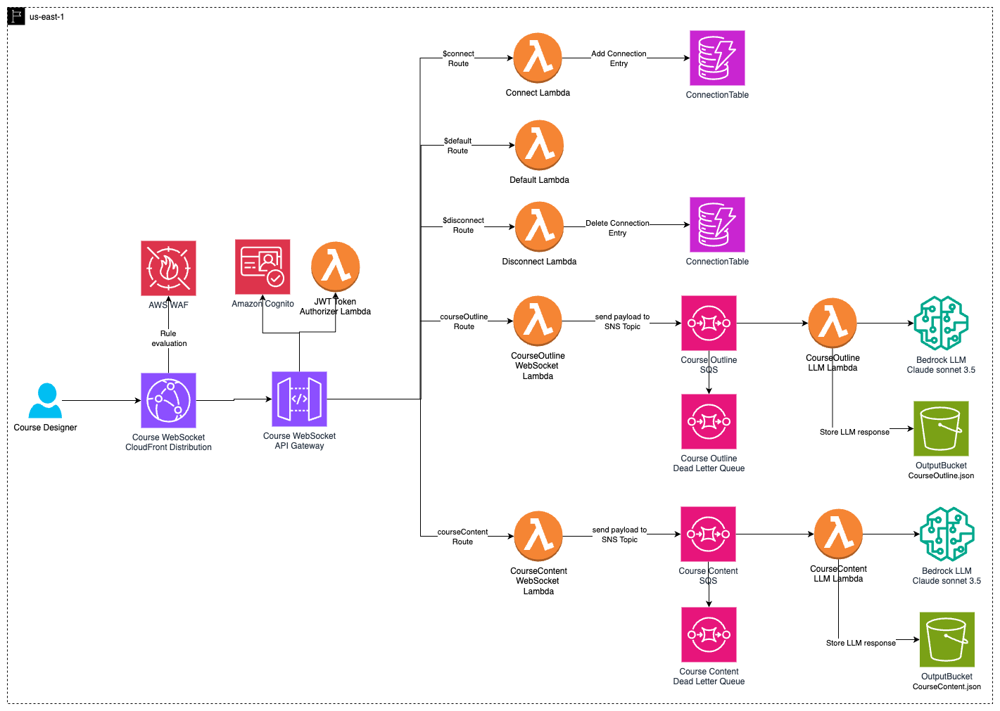
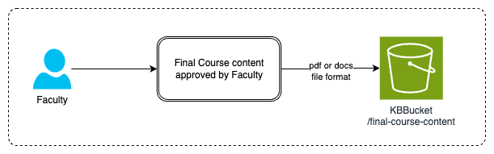
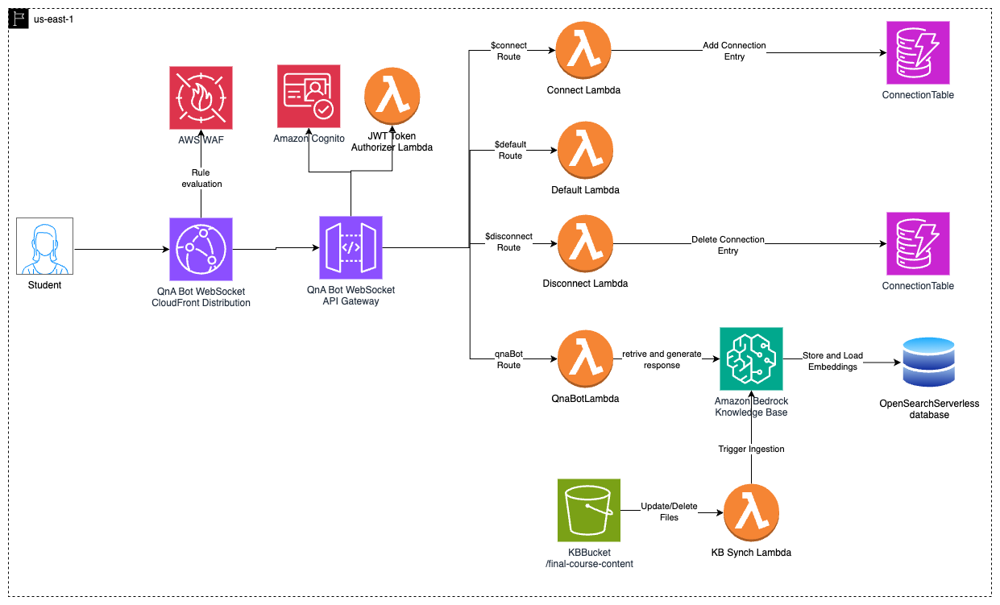

# Educational Course Content Generator with QnA Bot using Bedrock

This project provides a serverless application for generating educational course content and a question-answering bot using Amazon Bedrock. It leverages AWS services to create a scalable and secure solution for course creation and student interaction.

## Architecture Overview

The application consists of three main components, implemented across two WebSocket APIs:

**1. Course WebSocket API (`courseWSapi`):**
   - Course outline generator
   - Course content generator <br>
   Supported by:
   - AWS Lambda for processing
   - Amazon Bedrock for AI content generation
   - Amazon SQS for asynchronous processing
   - Amazon S3 bucket to store outputs



This solution handles course outline and content generation through a WebSocket API with the following components:

- Course Designer interacts via WebSocket connection through CloudFront distribution
- Security layer comprising AWS WAF and Amazon Cognito with JWT token authorization
- API Gateway WebSocket API managing different routes:
    - Connection management (connect/disconnect/default routes)
    - Course outline generation route
    - Course content generation route
- AWS Lambda functions processing each route
- Integration with Bedrock LLM (Claude Sonnet 3.5) for AI content generation
- Amazon SNS topics and Dead Letter Queues for reliable message handling
- S3 Output Buckets storing generated content



A streamlined content approval process that includes:

- Faculty review, finalize, and approve course content.
- Approved content is stored in a dedicated Knowledge Base S3 bucket (KBBucket) under /final-course-content.
- For demonstration purposes, sample course content is uploaded automatically during CDK deployment.


**2. QnA WebSocket API (`qnaWSapi`):**
   - Question-answering bot <br>
   Supported by:
   - AWS Lambda for processing
   - Amazon Bedrock KnowledgeBase for AI response generation
   - OpenSearch Serverless for data storage and retrieval
   - Knowledge Base synchronization via Lambda function
   - S3 bucket storing approved course content as knowledge source


Both WebSocket APIs share common security components (can be separated based on requirements):
- Amazon Cognito for user authentication
- AWS WAF for threat protection
- Lambda Authorizers for connection validation

Key architectural features:
- AWS Web Application Firewall (WAF) filters malicious traffic
- Amazon CloudFront serves as a WebSocket distribution layer for optimized content delivery
- Amazon SQS enables asynchronous processing of content generation requests
- Amazon Bedrock (Claude 3.5 Sonnet) powers the AI content generation
- DynamoDB Connection Tables for session management

Note: While this implementation uses shared security components for demonstration purposes, in production environments you may want to implement separate Cognito user pools, WAF rules, and Lambda Authorizers for each API based on your security requirements.

## Usage Instructions

### Installation

Prerequisites:
- Python 3.12
- AWS CDK CLI
- AWS CLI configured with appropriate credentials
- [wscat](https://github.com/websockets/wscat) installation for WebSocket testing

Steps:
1. Clone the repository
    ```
    git clone https://github.com/aws-samples/educational-course-content-generator-with-qna-bot-using-bedrock.git
    ```
2. Navigate to the project directory
    ```
    cd educational-course-content-generator-with-qna-bot-using-bedrock
    ```
3. Create a virtual environment:
   ```
   python -m venv .venv
   ```
4. Activate the virtual environment:
   - On Windows: `.venv\Scripts\activate.bat`
   - On Unix or MacOS: `source .venv/bin/activate`
5. Install dependencies:
   ```
   pip install -r requirements.txt
   ```
6. synthesize the CloudFormation template for this project.
    ```
    cdk synth --all
    ```
### Deployment

1. Review and modify the `project_config.json` file to customize your deployment settings.

2. Deploy the stacks:
   ```
   cdk deploy --all
   ```

3. Note the **CloudFront endpoints, WebSocket API endpoints and Cognito User Pool details** from deployment outputs

### Using the Application

1. Create a user in the Cognito User Pool using the AWS Console or CLI. Alternatively, you can use the [cognito-user-token-helper](https://github.com/aws-samples/cognito-user-token-helper) repository to easily create new cognito user and generate JWT tokens for testing.

2. Connect to the WebSocket endpoint using wscat.
   ```bash
   wscat -c wss://xxxxxxxxxx.execute-api.us-east-1.amazonaws.com/dev \
   -H "Authorization: Bearer YOUR_JWT_TOKEN"
   ```

3. To generate a course outline:
   - Send a message to the `courseOutline` route with the required parameters (course title, duration, etc.).
   - The system will generate and return a structured course outline.
   - **Sample course outline payload**
      ```json
      {
         "action": "courseOutline", 
         "is_streaming": "yes",
         "s3_input_uri_list": [],
         "course_title": "Fundamentals of Machine Learning",
         "course_duration": 4,
         "user_prompt": "I need help developing a {course_duration}-week course content for a {course_title} course. Please use the following syllabus to:\n\n1. If provided, refer to the syllabus text from <syllabus> tags to extract the course learning outcomes.\n2. Design each week to focus on 3 main learning outcomes.\n3. For each main learning outcome, provide 3 supporting sub-learning outcomes.\n\n<syllabus>\n\n{syllabus_text}\n\n</syllabus>\n\nEnsure that each week has 3 main learning outcomes and each of those has 3 supporting sub-learning outcomes."
      }
      ```
   - **Sample courseOutline route response**
      ```json
      {
         "course_title": "Sample Course",
         "course_duration": "X weeks",
         "weekly_outline": [
            {
                  "week": 1,
                  "main_outcomes": [
                     {
                        "outcome": "Learning Outcome 1",
                        "sub_outcomes": ["Sub-outcome 1", "Sub-outcome 2", "Sub-outcome 3"]
                     },
                     {
                        "outcome": "Learning Outcome 2",
                        "sub_outcomes": ["Sub-outcome 1", "Sub-outcome 2", "Sub-outcome 3"]
                     }
                  ]
            },
            {... similar for week 2},
            {... similar for week 3},
            {... similar for week 4},
         ]
      }
      ```

4. To generate course content:
   - Send a message to the `courseContent` route with the required parameters (course title, week number, learning outcomes, etc.).
   - The system will generate and return detailed course content, including video scripts, reading materials, and quiz questions.
   - **Sample course content payload**
      ```json
      {
         "action":"courseContent", 
         "is_streaming": "yes",
         "s3_input_uri_list": ["s3://bucket123/machine learning reference book.pdf"],
         "week_number":1,
         "course_title": "Fundamentals of Machine Learning",
         "main_learning_outcome" : "Understand the basics of machine learning and its applications",
         "sub_learning_outcome_list" : ["Define machine learning and its relationship to artificial intelligence","Identify real-world applications of machine learning","Distinguish between supervised, unsupervised, and reinforcement learning"],
         "user_prompt":"For the course {course_title}, \ngenerate Week {week_number} content for the main learning outcome:\n{main_learning_outcome}\n\nInclude the following sub-learning outcomes:\n{sub_learning_outcome_list}\n\nFor each sub-learning outcome, provide:\n- 3 video scripts, each 3 minutes long\n- 1 set of reading materials, atleast one page long\n- 1 multiple-choice question per video with correct answer\n\nIf provided, refer to the information within the <additional_context> tags for any supplementary details or guidelines.\n\n<additional_context>\n{additional_context}\n</additional_context>\n\nGenerate the content without any introductory text or explanations."
      }
      ```
    - **Sample courseContent route response**
      ```json
      {
         "CourseContent":{
            "week_number":1,
            "main_learning_outcome":"Learning Outcome 1",
            "reading_material":{
               "title":"xxx title of the reading material",
               "content":"xxx reading material content"
            },
            "sub_learning_outcomes_content":[
               {
                  "sub_learning_outcome":"Sub-outcome 1",
                  "video_script":{
                     "script":"xxx video script"
                  },
                  "multiple_choice_question":{
                     "question":"xxx MCQ question",
                     "options":["option 1","option 2","option 3","option 4"],
                     "correct_answer":"option 1"
                  }
               },
               {... similar for sub_learning_outcome 2},
               {... similar for sub_learning_outcome 3},
            ]
         }
      }
      ```

5. To use the QnA bot:
   - Send questions to the `qnaBot` route.
   - The bot will provide answers based on the course content in the knowledge base.
   - **Sample QnA Bot payload**
      ```json
      {
         "action": "qnaBot",
         "user_question": "What is machine learning?",
         "course_name": "Fundamentals of Machine Learning",
         "course_id": "Dummy-c001",
         "week_number": 2
      }
      ```
   - **Sample qnaBot route response**
      ```json
      {
         "bot_response":"Machine learning (ML) is a subset of artificial intelligence that focuses on developing algorithms and statistical models....",
         "response":{
            "ResponseMetadata":{...},
            "citations":[
               {
                  "generatedResponsePart":{...},
                  "retrievedReferences":[...]
               }
            ],
            "guardrailAction":"NONE",
            "output":{
               "text":"..."
            },
            "sessionId":"..."
         }
      }
      ```


## Data Flow

1. User connects to the ClouFront endpoint which is attached to WebSocket API and authenticates.
2. User sends a request for course outline or content generation.
3. The request is processed by the appropriate Lambda function.
4. The Lambda function invokes Amazon Bedrock to generate the requested content.
5. Generated content is stored in S3 and returned to the user via WebSocket.
6. For QnA, user questions are processed by the QnA bot Lambda, which uses Bedrock and the knowledge base to generate answers.

This flow ensures real-time communication, secure authentication, and efficient processing of user requests for course generation and question answering.


## Security Features

The application implements multiple layers of security:
- AWS WAF protects against malicious traffic and common web-based threats
- Amazon CloudFront provides built-in DDoS protection
- Amazon Cognito handles user authentication
- JWT-based Lambda Authorizers validate WebSocket connections
- AWS IAM policies enforce strict access control to AWS resources

## Scalability and Performance

### Scalability
- Amazon SQS ensures asynchronous processing.
- AWS Lambda auto-scales dynamically.
- CloudFront optimizes content delivery.
- DynamoDB auto-scales for connection/session management.

### Performance Optimization
- CloudFront caching reduces latency.
- WebSocket API enables real-time interaction.
- DynamoDB ensures millisecond-level query response times.
- Amazon SQS buffers high-load requests.

## Security

See [CONTRIBUTING](CONTRIBUTING.md#security-issue-notifications) for more information.

## License

This library is licensed under the MIT-0 License. See the LICENSE file.

